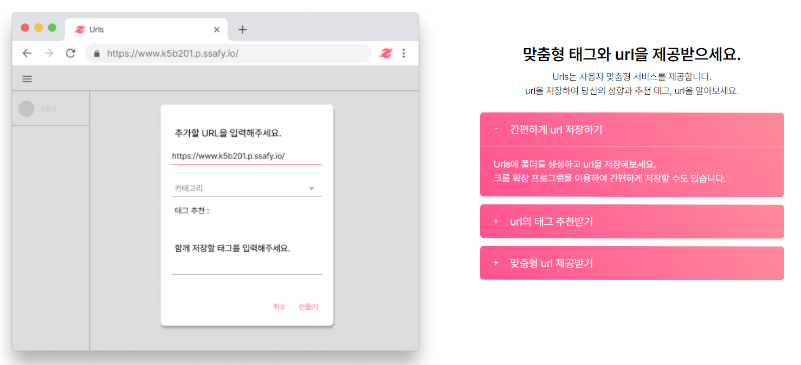

# S05P31B201

## 프로젝트 명: URLS - 똑똑하게 저장하고 나누는 방법

## 팀명: 이글 아이팀

## Preview

## 기술 스택

### Cient
- Android
- chrome-extensions

### Frontend
- Vue with Quasar

### Backend
- FastAPI

### Infra
- Kubernetes
- mongo db 
- elasticsearch
- Nginx

## 팀원

- 김재현 (client)
- 김문희 (FE)
- 김우석 (DevOps. FE)
- 이다은 (BE)
- 이두호 (AI)

## Git Flow

## Git Convention

- **ADD :** 코드나 테스트, 예제, 문서 등의 추가가 있을 때 사용합니다
- **REMOVE :** 코드의 삭제가 있을 때 사용
- **UPDATE :** 원래도 정상적으로 동작하고 있었지만, 수정, 추가, 보완을 한다는 개념입니다.
- **RENAME :** 파일/폴더 이름 변경이 있을 때 사용합니다.
- **FIX :** 보통 올바르지 않은 동작을 고친 경우에 사용합니다.
- **MOVE :** 코드/폴더 의 이동이 있을 때 사용합니다.
- **SET :** 변수 값을 변경하는 등의 작은 수정에 주로 사용합니다.
- **REFACTOR :** 리팩토링할 때 사용합니다.
- **DOCS :** 사이트/문서 업그레이드 할 때 사용합니다.
